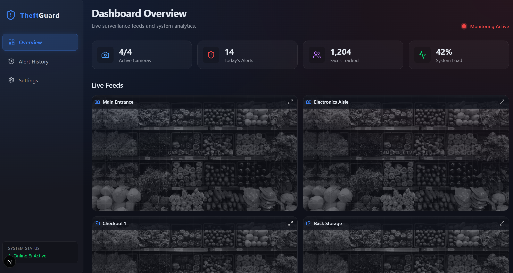
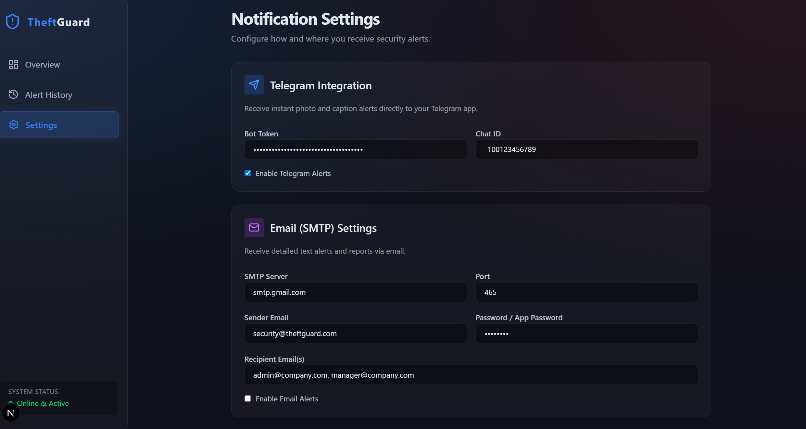
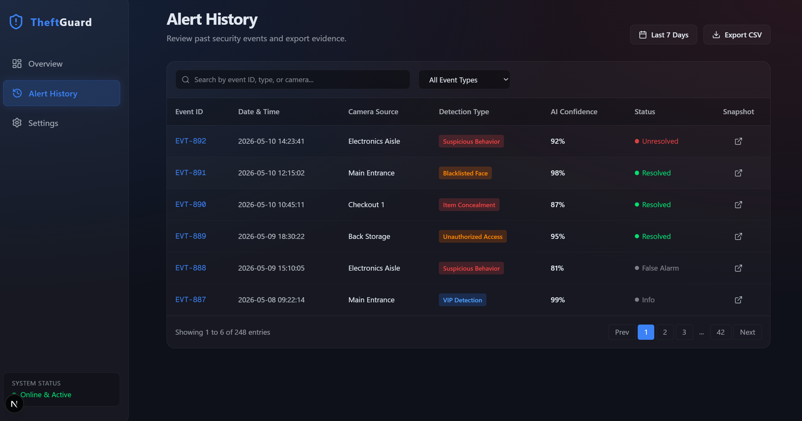

# TheftGuard AI - Advanced Anti-Theft AI Security System

TheftGuard AI is an advanced, enterprise-grade video surveillance and anti-theft security solution designed for retail spaces, supermarkets, and smart facilities. It utilizes cutting-edge Computer Vision, real-time Pose Estimation, Object Detection, and Facial Recognition algorithms to detect shoplifting, loitering, restricted area intrusions, and fighting. 

The system leverages optimized, multi-threaded pipelines to analyze concurrent camera feeds (local webcams or RTSP network cameras) synchronously, triggering instant browser-synthesized audio sirens and sending remote alerts via Email and Telegram.

**Live Demo:** [theft-detection-dusky.vercel.app](https://theft-detection-dusky.vercel.app/)

[](https://theft-detection-dusky.vercel.app/)

---

## Premium System Capabilities & Key Features

### 1. Multi-Threaded Camera Architecture
*   **Asynchronous Frame Reading:** Captures frames independently via high-performance python threading (`ThreadedCamera`), avoiding sequential frame capture lag or UI freezes.
*   **Robust Multi-Camera Tracking:** Dynamically resolves tracker ID conflicts across multiple feeds simultaneously by isolating states uniquely using camera-to-person composites `(camera_id, track_id)`.

### 2. Interactive Canvas ROI Drawer
*   **HTML5 Canvas Drawing Tool:** Draw precise security boundaries (Polygons) overlaying live webcam/RTSP feeds directly inside a glassmorphic dashboard modal.
*   **Resolution-Agnostic Scaling:** Autonomously maps client-side mouse vectors into exact `1280x720` surveillance matrix coordinates, preventing scaling discrepancies across different screen resolutions.
*   **Camera-Specific Storage:** Camera definitions and their respective ROI coordinate lists are saved persistently inside `cameras.json`.


### 3. Advanced Behavior & Posture Estimation
*   **Item Concealment Logic:** Recognizes when a person picks up a target retail item and monitors hand-to-pocket/bag gestures, flagging potential concealment attempts.
*   **Loitering Detection:** Evaluates how long a person dwells within a specific ROI. If loitering exceeds the configurable threshold, an alarm is triggered.
*   **Zone Intrusion Alerts:** Instantly sounds sirens if human wrists cross into high-security zones (e.g., cash register areas, restricted aisles).
*   **Postural Suspicion:** Detects unusual physical behavior such as sudden bending down in low-visibility aisles.
*   **Activity Heatmaps:** Localized heatmap accumulators aggregate and visually plot customer traffic patterns individually for each camera stream.

### 4. Facial Recognition & Database Panel
*   **Face ID Classification:** A dedicated, premium **Face Management** panel to upload portrait photos, register new faces, and assign categorizations:
    *   **Blacklist:** Automatically triggers high-priority security alarms and records evidence.
    *   **VIP Whitelist:** Identifies trusted staff, loyal clients, or VIP visitors, showing a green greeting badge.
*   **Instant Face Database Deletion:** One-click instant SQLite deletion with automatic memory synchronization.


### 5. Client-Side Synthetic Audio Siren & Notifications
*   **Web Audio API Integration:** Avoids brittle MP3 loading loops by synthesizing realistic, sweeping emergency sirens directly in the browser's audio processor in real-time when alarms fire.
*   **High-Priority Cooldowns:** Protects users from noise fatigue by enforcing a 3-second smart alarm cooldown period.
*   **Telegram & SMTP Setup:** Instantly broadcast alerts and snapshots via Telegram chat integrations and automated Email notifications.



### 6. Centralized Glassmorphic Control Room
*   **Performance Telemetry:** Displays dynamic CPU usage and Memory (RAM) virtual bars mapped directly from backend psutil resources.
*   **Weekly Trends:** Integrates custom, sleek Recharts data visualizations highlighting security events categorized by "Suspicious Behavior" and "Reviewed/False Alarms".
*   **Advanced Filtering & CSV Export:** Search historical logs by ID, message, or camera, filter by event categories, and download filtered alerts into a clean Excel/CSV file with a single click.



---

## Technical Architecture

*   **Backend Engine:** Python 3.10+, FastAPI (Asynchronous API endpoints & WebSockets), OpenCV (Multi-threaded streaming), Ultralytics YOLOv8 (Stand-alone Pose & Object model detection), `face_recognition` (Dlib-based CNN face encodings), SQLite3 (Database storage for logs & face matrices).
*   **Frontend Dashboard:** Next.js 14+ (App Router), React 18, Tailwind CSS, Recharts (Modern chart libraries), Lucide React (Fluent vector icons), HSL Custom Themes (Harmonious Glassmorphic Dark UI).

---

## Installation Guide

### Prerequisites
*   Python 3.9 - 3.11
*   Node.js (LTS version)
*   CUDA Enabled NVIDIA GPU (Highly recommended for fluid real-time inference)

### 1. Backend Configuration
Clone the repository and install the Python dependencies:

```bash
git clone https://github.com/vahapogut/Theft-Detection.git
cd Theft-Detection
pip install -r requirements.txt
```

*Note: If you have a custom pre-trained hırsızlık model (`shoplifting.pt`), place it in the root directory. The system will automatically detect it and upgrade from default pose algorithms to the specialized neural net.*

### 2. Dashboard UI Configuration
Install node packages:

```bash
cd dashboard
npm install
```

---

## Running the System

### Automatic Startup (Windows)
Launch both the FastAPI service and the Next.js development server concurrently with a single click:
```bash
start_system.bat
```

### Manual Startup
**1. Start the API Server & Inference Loop:**
```bash
python backend.py
```
*(The server will boot on `http://localhost:8000` and stream WebSockets on `ws://localhost:8000/ws`)*

**2. Start the Frontend Dashboard:**
```bash
cd dashboard
npm run dev
```
*(The panel will be served on `http://localhost:3000`)*

**3. Optional Standalone OpenCV Window Demo:**
```bash
python standalone_demo.py
```

### Docker Deployment 🐳

For containerized deployment, use Docker to run the entire system with a single command:

**Quick Start:**
```bash
# Windows (PowerShell)
.\docker-start.ps1

# Linux/Mac
./docker-start.sh
```

**Manual Docker Commands:**
```bash
# Build and start all services
docker-compose up -d

# View logs
docker-compose logs -f

# Stop services
docker-compose down
```

The Docker setup includes:
- ✅ Backend API with all dependencies (port 8000)
- ✅ Next.js Dashboard (port 3000)
- ✅ Persistent volumes for database, alerts, and face data
- ✅ Health checks and automatic restarts
- ✅ Multi-stage optimized builds
- ✅ Stable Docker dependency set via requirements.docker.txt (without optional insightface build)

**Access the containerized services:**
- Backend API: http://localhost:8000
- API Documentation: http://localhost:8000/docs
- Dashboard: http://localhost:3000

📖 **For detailed Docker documentation, see [DOCKER_DEPLOYMENT.md](DOCKER_DEPLOYMENT.md)**

---

## Contributing 

1. Fork this repository.
2. Create your feature branch (`git checkout -b feature/CoolFeature`).
3. Commit your upgrades (`git commit -m 'feat: add cool feature'`).
4. Push to your branch (`git push origin feature/CoolFeature`).
5. Open a Pull Request.

---

## License

Distributed under the MIT License. See `LICENSE` for more information.

---

*Project Maintainer & Developer: **Abdulvahap Öğüt***  
*GitHub Repository:* [vahapogut/Theft-Detection](https://github.com/vahapogut/Theft-Detection)
